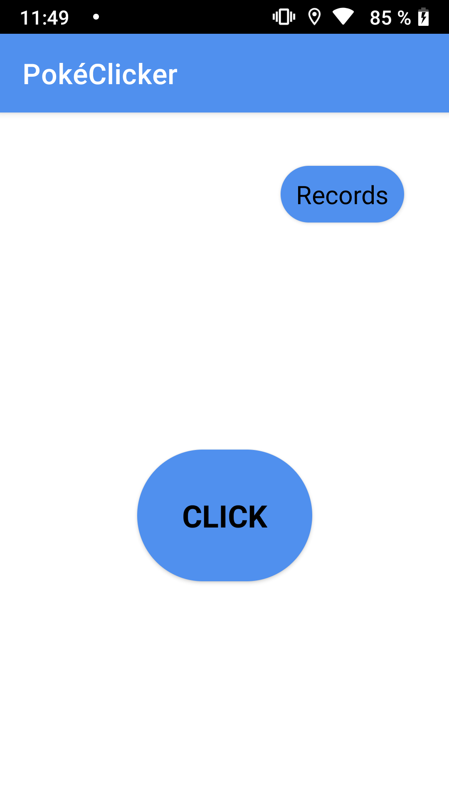
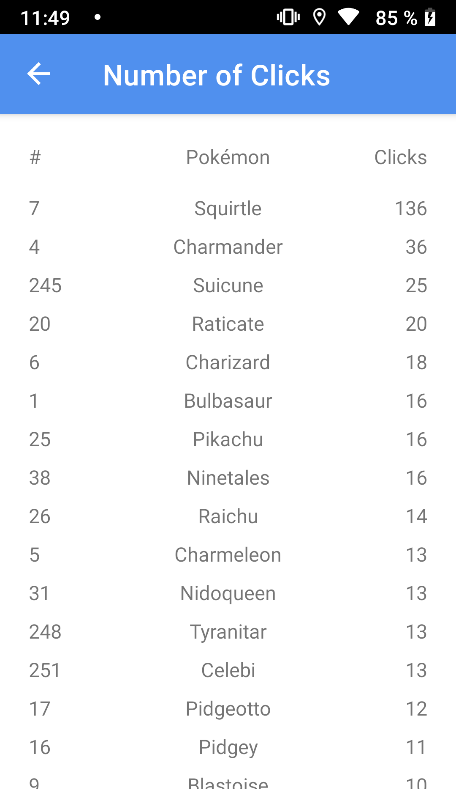
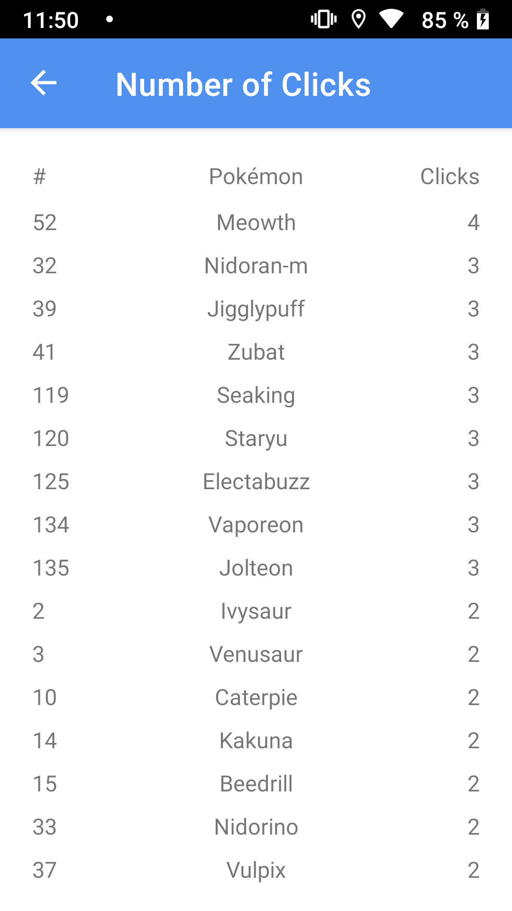
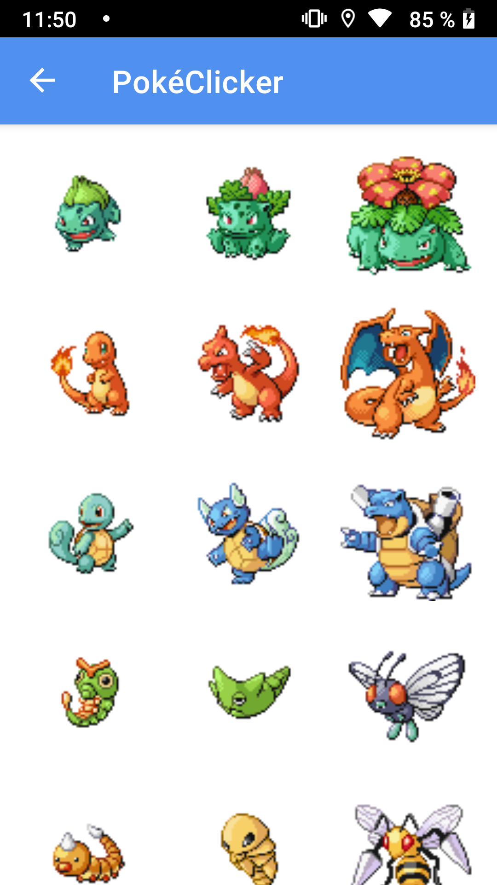
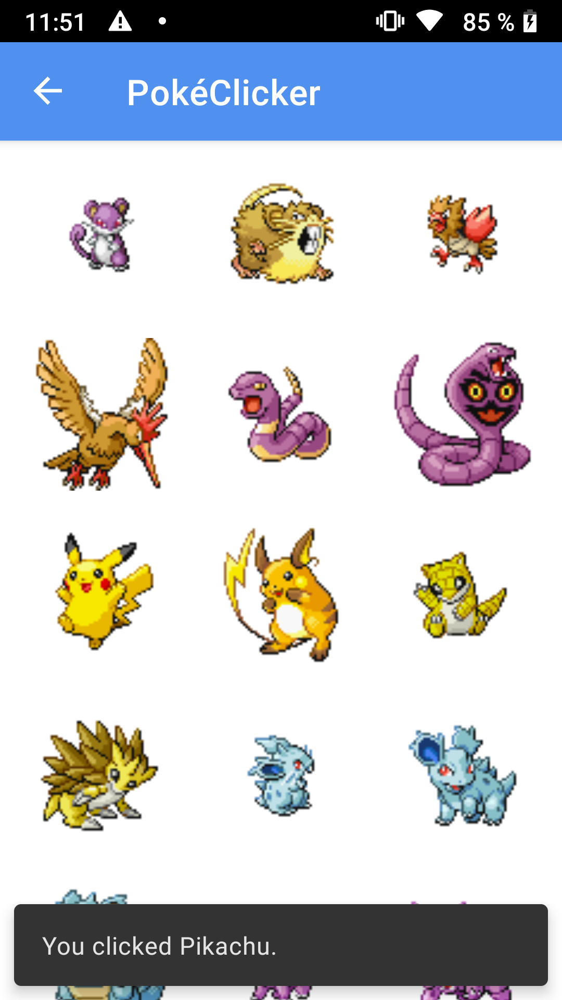
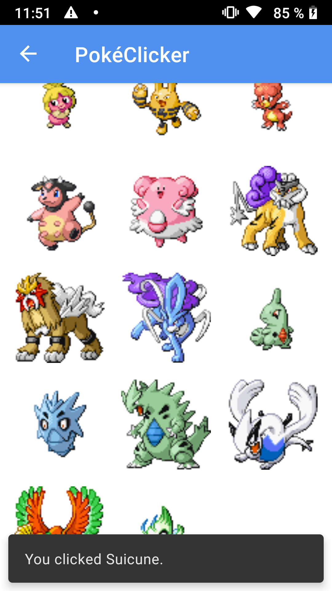
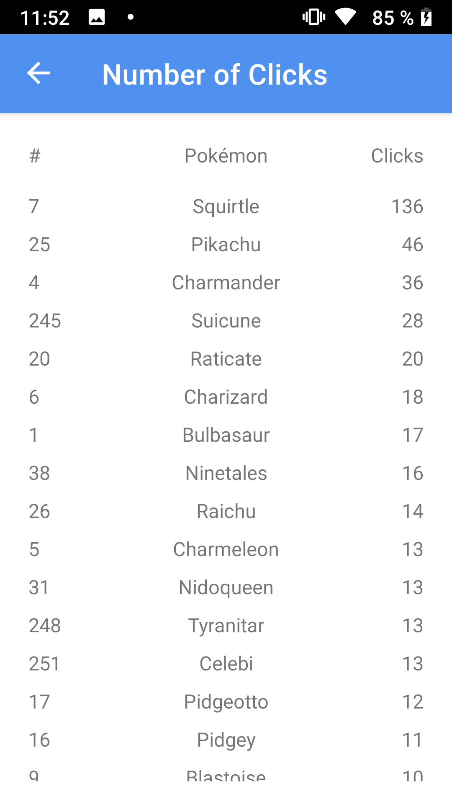

[RULES IN ENGLISH BELOW]

Ta aplikacija je preprosta igra, v kateri lahko uporabnik klika slike Pokémonov, podatki o številu klikov pa so prikazani na seznamu.
Za ogled seznama kliknite »Records«.
Za začetek igre kliknite »Click«.

Če kliknete »Records«, se prikaže seznam, razvrščen po številu klikov, z imeni, zaporednimi številkami in podatki o številu klikov vsake slike Pokémona. Baza podatkov se ustvarja, ureja in prikazuje z možnostjo Room.

 

Če kliknete »Click«, se igra začne tako, da se s knjižnico Coil, ki dostopa do spletnega API-ja PokéAPI, naložijo slike vseh Pokémonov z zaporednimi številkami od 1 do 251. PokéAPI sestavljajo objekti JSON s številnimi podatki o vsakem Pokémonu – ta aplikacija dostopa do imena, zaporedne številke in povezave do slike, shranjene v strežniku.

Ob kliku slike Pokémona, se prikaže vrstica s povratno informacijo z imenom Pokémona, ki ste ga kliknili.

 

Po vsakem kliku se tudi baza podatkov samodejno posodobi z novim številom klikov posameznega Pokémona. Če se vrnete na prejšnji zaslon in znova kliknete »Records«, lahko vidite posodobljen seznam.

[ENGLISH]

This app is a simple game that lets the user click the images of Pokémon and shows a list with the data on the number of clicks.
Click "Records" to see the list.
Click "Click" to start a game.

After clicking "Records", the list of names, numbers and data on the clicks of each Pokémon is shown, sorted by the number of clicks. Database is being created, edited and displayed using Room.

 

After clicking "Click", the game starts with the Coil library that accesses web API PokéAPI loading the sprites of all Pokémon with numbers 1 through 251. PokéAPI consists of JSON objects of numerous data on each Pokémon – this app accesses the Pokémon’s name, number and the link to the sprite, saved in the server.

Upon clicking a Pokémon sprite, a snack bar message is shown with the name of the Pokémon you clicked.

 

After each click, the database automatically updates with the new number of click of a specific Pokémon. Returning to the previous screen and clicking "Records" again lets you see the updated list.

